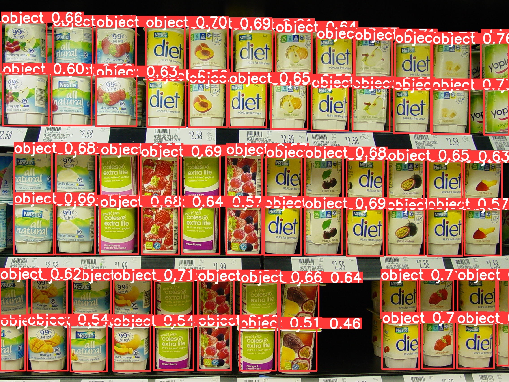

# WebMarket Object Detection
This repository contains approach to create a model that identifies the objects/products given in the image using [WebMarket DataSet](https://www.kaggle.com/datasets/manikchitralwar/webmarket-dataset) present on Kaggle.

## Description
The objective is to create a model that can identify the objects or the products present in the image from WebMarket. We have two type of datasets one type is the images and other one is a csv file that have the details about the annotations (pixel) and dimensions with respect to the images. Here YOLOv8 from YOLO Family which is written in PyTorch Framework is used for the purpose.

## Features
- The model is able to identify the products in the image provided from the WebMarket Dataset.
- Light-weight and easy to use.

## Setup and Usage
- Clone the repository: git clone https://github.com/rabhardwaj16/WebMarket_Object_Detection.git

- Install the required dependencies. Make sure you have Python 3.x `(in my case it was 3.8.10)` and pip installed. Run the following command: pip install -r requirements.txt

- For PyTorch installation please visit the [official page](https://pytorch.org/).

- Get into directory of the project and run `python predict_script.py image_location --save`  from the terminal.

- For example in my case it was `python3 predict.py /Users/rajatbhardwaj/Downloads/WebMarket_Object_Detection/data/images/test/db167.jpg --save`.

## Dataset

https://www.kaggle.com/datasets/manikchitralwar/webmarket-dataset

## Result
> Image Given

> Result Image

